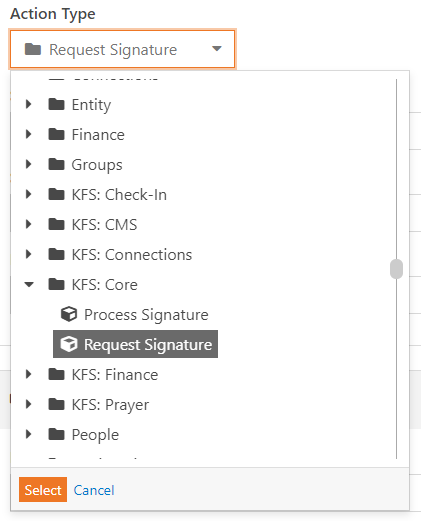
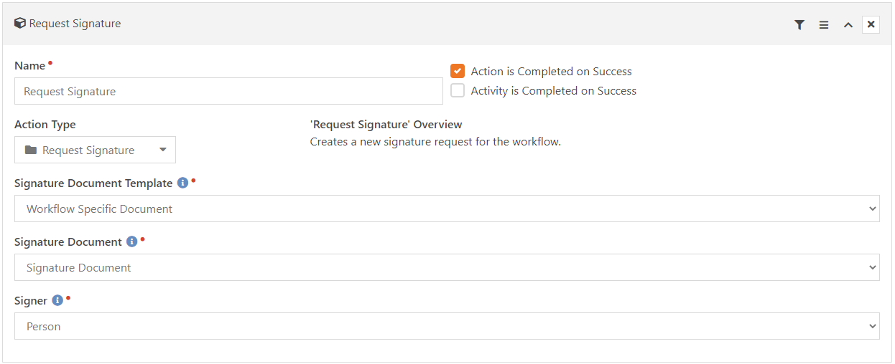
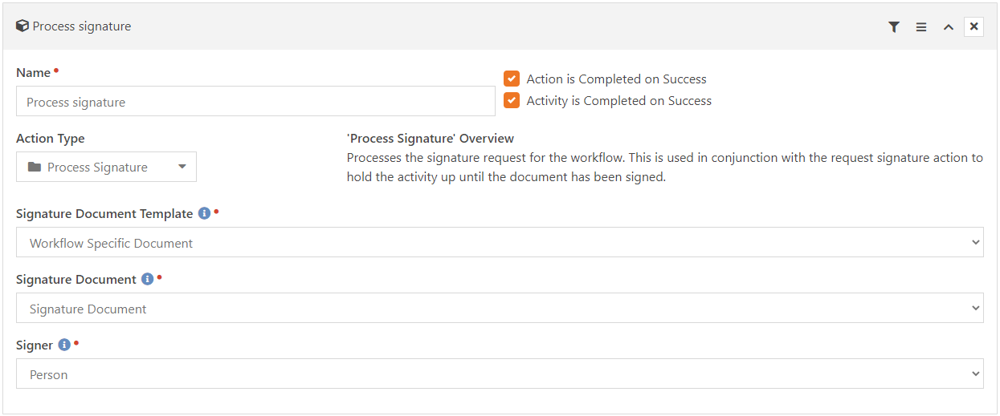

# Digital Signature Workflow Actions

*Tested/Supported in Rock version: 11.3*

*Released: 12/10/2020*  

## Summary

These workflow actions give you the ability to request a digital signature from within a workflow.

Quick Links:
- [What's New](#whats-new)
- [Configuration](#configuration)

## What's New
---
- Released v1

## Configuration
---

Two new KFS actions are added under KFS: Core.



**Request Signature**



**Process Signature**



```
    Name: Action name

    Action Type: Request Signature/Process Signature

    Signature Document Template: The signature document template to send out/check for when this action runs.

    Signature Document: The workflow attribute to store the created digital signature document in.
   
    Person: The workflow attribute of the person the signature request will go to.
    
```


