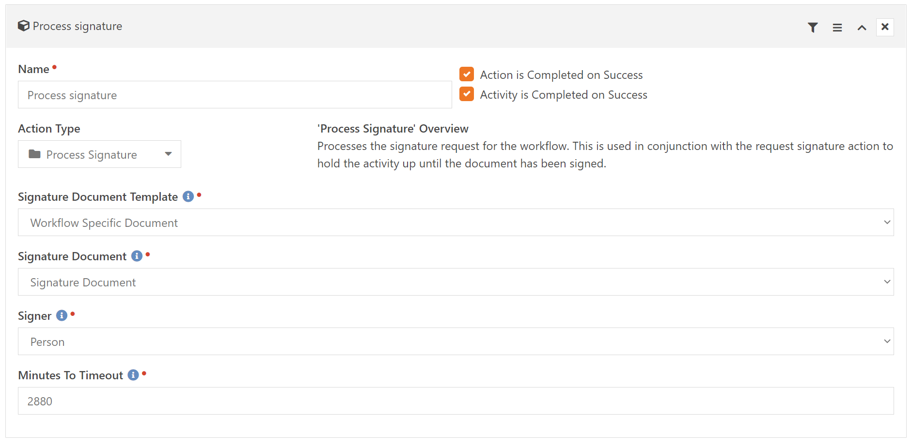

# Digital Signature Workflow Actions

*Tested/Supported in Rock version: 11.3*

*Released: 12/10/2020*  

## Summary

These workflow actions give you the ability to request a digital signature from within a workflow.

Quick Links:
- [What's New](#whats-new)
- [Configuration](#configuration)

## What's New
---
- Added new setting "Minutes to Timeout" to Process Signature action.
- Released v1

## Configuration
---

Two new KFS actions are added under KFS: Core.


**Request Signature**


    Name: Action name
    
    Action Type: Request Signature
    
    Signature Document Template: The signature document template to send out when this action runs.
    
    Signature Document: The workflow attribute to store the created digital signature document in.
       
    Signer: The workflow attribute of the person the signature request will go to.

**Process Signature**



```
    Name: Action name

    Action Type: Process Signature

    Signature Document Template: The signature document template to check for when this action runs.

    Signature Document: The workflow attribute to store the created digital signature document in.
   
    Signer: The workflow attribute of the person the signature request was sent to.
    
    Minutes to Timeout: The number of minutes to wait for a signature before timing out the action (marking the action as successful to move on) Default: 2880 (2 Days).
    
```


